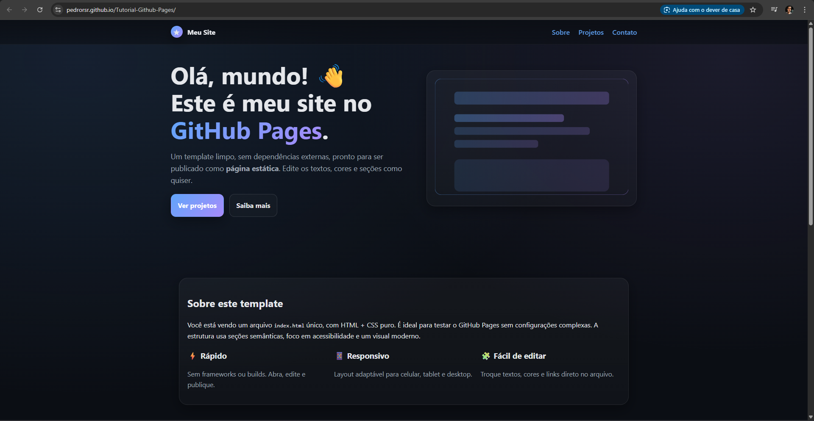


# O que é o GitHub Pages?

O **GitHub Pages** é um serviço gratuito do GitHub que hospeda e publica sites estáticos diretamente de um repositório do GitHub. Ele "pega arquivos HTML, CSS e JavaScript diretamente de um repositório no GitHub, opcionalmente executa os arquivos através de um processo de build, especialmente com suporte integrado para Jekyll (gerador de site estático) e publica um site." É ideal para portfólios, sites de projetos, blogs ou páginas pessoais. 
-  **Site Estático**: Focado em sites que não requerem um servidor de back-end (como PHP ou Node.js).

---

## Disponibilidade
O GitHub Pages está disponível em diversos planos do GitHub, com algumas variações na sua acessibilidade e funcionalidades:

- **GitHub Free (usuários e organizações)** → disponível apenas em repositórios **públicos**.  
- **GitHub Pro, GitHub Team, GitHub Enterprise Cloud e GitHub Enterprise Server** → disponível em repositórios **públicos e privados**.  
- Para publicar sites de forma **privada**, é necessário ter uma **conta de organização** no **GitHub Enterprise Cloud**.  

---

## Para que serve o GitHub Pages?

O GitHub Pages é versátil e pode ser usado para:

- **Hospedagem de Sites Pessoais ou de Organizações**  
  Ex.: `username.github.io`.  

- **Hospedagem de Sites de Projetos**  
  Facilita a publicação de projetos online, mostrando o trabalho de desenvolvedores.  

- **Portfólios Online**  
  Desenvolvedores podem exibir seus trabalhos.  

- **Blogs e Currículos Online**  

- **Documentação de Projetos**  

- **Compartilhamento de Projetos de Código Aberto**  

É possível usar o **subdomínio gratuito** do GitHub (`username.github.io`) ou configurar um **domínio personalizado**.  

---

## Diferença entre Repositório Normal e Repositório com Pages

A principal diferença está na **funcionalidade de publicação online** que o GitHub Pages adiciona ao repositório.

### 🔹 Repositório Normal
- Local para armazenar, gerenciar e rastrear alterações do código com Git.  
- Facilita a colaboração entre desenvolvedores e mantém o histórico de versões.  
- Arquivos podem ser visualizados na interface do GitHub, mas **não são publicados automaticamente** como um site acessível publicamente.  

### 🔹 Repositório com GitHub Pages
- É um repositório normal **configurado para hospedar um site estático**.  
- Arquivos HTML, CSS, JS (e Markdown processado pelo Jekyll) são publicados como um **site acessível por URL** (`username.github.io` ou domínio personalizado).  
- Pode ser configurado para publicar a partir de:
  - Uma **branch específica**.  
  - Um **workflow do GitHub Actions**.  

**Tipos de sites com Pages:**
- **Sites de Usuário/Organização** → devem estar em um repositório nomeado `<owner>.github.io`.  
- **Sites de Projeto** → armazenados em uma pasta dentro do repositório do projeto.  

---

✅ **Resumo**:  
- Um **repositório normal** é usado para gerenciamento de código.  
- Um **repositório com GitHub Pages** amplia essa função, permitindo **publicar o código como um site estático acessível na web**.  

# Github Pages: Aplicações práticas e Jekyll

## Exemplos de uso (com mini-explicação)

•⁠  ⁠*Portfólio pessoal / currículo online*
  Página simples com seções “sobre”, projetos, contato e links, fácil de manter como um repo (⁠ username.github.io ⁠) e atualizar com commits.
•⁠  ⁠*Documentação de projeto / API*
  Documentação versionada/organizada (páginas, navegação lateral, exemplos de código). Pode ser hospedada junto ao código-fonte para garantir que docs e código permaneçam sincronizados.
•⁠  ⁠*Landing page de projeto / produto*
  Página estática com descrição, screenshots, badges, CTAs e links para download/repósitório. Ideal para apresentar um projeto rapidamente.
•⁠  ⁠*Blog técnico*
  Posts em Markdown com metadata (data, tags, autor) ideal para posts curtos, tutoriais e release notes.
•⁠  ⁠*Sites institucionais simples*
  Pequenas páginas para eventos, grupos de estudo, com páginas estáticas e formulário de contato (por serviços externos).
•⁠  ⁠*Apresentação de trabalhos / slides estáticos*
  Hospedar slides exportados em HTML (reveal.js) ou páginas com exemplos interativos (padrão estático).

---

## Vantagens

•⁠  ⁠*Gratuito e integrado ao GitHub*: deployment automático a partir do repositório (push → build → site).
•⁠  ⁠*Fácil de versionar*: todo site é código no Git controle de histórico, branches e colaboração.
•⁠  ⁠*Bom para conteúdo em Markdown*: escrever em ⁠ .md ⁠ e o site é gerado automaticamente (quando usar Jekyll).
•⁠  ⁠*Suporte a domínio customizado e HTTPS automático*: você pode usar seu domínio e ter HTTPS sem configuração extra.
•⁠  ⁠*Rápido e barato de manter*: sites estáticos carregam rápido e exigem pouca ou nenhuma manutenção de infra.

---

## Limitações

•⁠  ⁠*Só serve sites estáticos*: não roda código server-side (PHP, Node dinâmico, DBs no servidor). Para funcionalidades dinâmicas, precisa de serviços externos (APIs, forms terceiros).
•⁠  ⁠*Plugins restritos*: o build realizado pelo GitHub Pages só aceita plugins/jekyll-plugins aprovados; se você precisar de plugins não suportados, precisa gerar o site localmente/CI e enviar os arquivos estáticos (⁠ _site ⁠).
•⁠  ⁠*Customização avançada exige conhecimento*: temas e layouts são fáceis, mas personalizações profundas demandam HTML/CSS/Liquid.

---

## Explicação rápida sobre o Jekyll

### O que é

Jekyll é um *gerador de sites estáticos* escrito em Ruby. Ele converte arquivos Markdown e templates (Liquid) em HTML estático, aplicando layouts, includes e variáveis definidas no front matter (YAML no topo dos arquivos ⁠ .md ⁠).

### Por que o GitHub Pages oferece suporte nativo

GitHub Pages foi concebido para facilitar a publicação de sites a partir de repositórios o Jekyll se tornou o gerador padrão porque transforma Markdown em HTML de forma simples e previsível, permitindo que o GitHub construa automaticamente o site a cada push sem exigir que o usuário configure uma pipeline complexa.

### Situações em que o Jekyll é especialmente útil

•⁠  ⁠*Blogs e posts com metadata* (data, tags, categorias) Jekyll lida nativamente com coleções de posts.
•⁠  ⁠*Documentação ligada ao código* escrever docs em Markdown e ter navegação automática e templates consistentes.
•⁠  ⁠*Sites que precisam de templates reutilizáveis* layouts, includes e collections tornam fácil criar páginas similares.
•⁠  ⁠*Quando você quer editar conteúdo com Git* colaboradores podem abrir PR com mudanças de conteúdo (posts/docs) e tudo vira parte do fluxo de desenvolvimento.

---

---

# Tutorial GitHub Pages

Este tutorial tem como objetivo ensinar a usar e ativar o GitHub Pages.

---

## 1. Criando um repositório

Para ativar o GitHub Pages, é necessário possuir um repositório.  
Para isso, clique na sua foto de perfil no canto superior direito no **github.com** e depois vá em **"Repositories"**.  
Em seguida, clique em "New".

Em seguida, digite o nome do seu repositório e aperte em "Create repository".

Você vai precisar de um arquivo **"index.html"** para que seja possível ativar o GitHub Pages, então clique em "upload an existing file" e selecione o arquivo desejado.

Depois, aperte em "Commit changes".

---

## 2. Ativando o GitHub Pages

Se você tiver feito tudo certo, seu arquivo deve aparecer na aba inicial do seu repositório.

Agora clique em **"Settings"** > **"Pages"** e modifique a **Branch** para a **main** e depois aperte em **"Save"**.

Depois de algum tempo, atualize a página e o link da sua página deve aparecer.  
Aperte em **"Visit site"**.

---

## 3. Página criada!

Agora você pode ver sua bela página.

